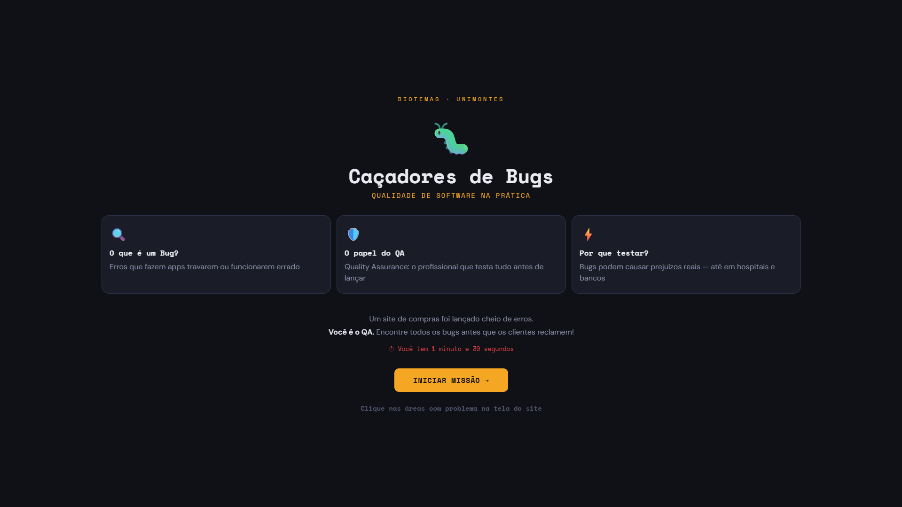

<p align="center">
  
</p>

## 🎉 Let's go!

Para iniciar o projeto insira o comando:

```
npm run dev
```

ou entre no link:

```

```

## 🎥 Demonstração


## 💻 Projeto

Aplicação web interativa desenvolvida como parte da exposição **"Caçadores de Bugs: Qualidade de Software na Prática"**, apresentada no **Programa Biotemas da UNIMONTES**.

O app simula um site de e-commerce com erros propositais para que estudantes do Ensino Fundamental e Médio possam identificar bugs reais de interface, aprendendo de forma lúdica o que é qualidade de software e o papel do profissional de **QA (Quality Assurance)**.

A aplicação conta com um sistema de pontuação baseado em bugs encontrados e tempo restante, além de um painel explicativo para cada erro identificado — mostrando na prática o impacto que bugs podem ter em produtos reais.

<br>

## 🚀 Tecnologias

Esse projeto foi desenvolvido com as seguintes tecnologias:

- HTML e CSS
- TypeScript
- React
- Node e NPM
- Vite

## 📚 Funcionalidades

- Tela introdutória com contexto sobre bugs, QA e testes de software
- Site simulado com 5 bugs clicáveis de diferentes severidades (crítico, moderado e leve)
- Painel lateral explicativo para cada bug encontrado
- Cronômetro regressivo de 1 minuto
- Sistema de pontuação baseado em bugs encontrados e tempo restante
- Tela de resultado com relatório completo e descrição educativa de cada erro
